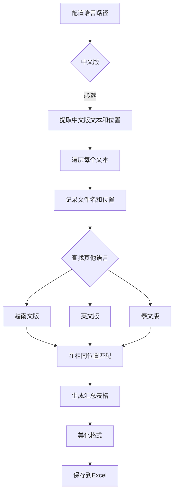

# 更新日志 - v1.21.0

## 版本信息
- **版本号**: v1.21.0
- **发布日期**: 2025-11-12
- **更新类型**: 功能重构

## 主要更新

### 🔄 翻译提取工具重构

#### 1. 语言配置调整

**之前 (v1.20.0)**:
```
支持5种语言：
- 中文版
- 越南文版
- 英文版
- 韩文版 ❌
- 日文版 ❌
```

**现在 (v1.21.0)**:
```
支持4种语言：
- 中文版（基准，必选）
- 越南文版（默认）
- 英文版（额外支持）
- 泰文版（新增）⭐
```

#### 2. 输出格式重构

**之前的输出方式**:
```
output_dir/
├── 中文/
│   ├── file1.xlsx
│   └── file2.xlsx
├── 越南文/
│   ├── file1.xlsx
│   └── file2.xlsx
├── 英文/
│   └── file1.xlsx
└── ...
```

**新的输出方式**:
```
output_dir/
└── 翻译提取汇总.xlsx  ← 单一汇总文件
```

**汇总表格结构**:
```
| name       | num | cn     | vn         | en            | th             |
|------------|-----|--------|------------|---------------|----------------|
| file_name  | F7  | 配置项 | Cấu hình   | Configuration | การกำหนดค่า   |
| file_name  | F8  | 描述   | Mô tả      | Description   | คำอธิบาย      |
```

#### 3. 工作流程优化

**新的处理流程**:


## 技术改进

### 1. 匹配算法优化

**精确位置匹配**:
```python
# 以中文版为基准
for cn_item in cn_data['items']:
    excel_pos = cn_item['excel_row_ref']  # 如 "F7"
    cn_text = cn_item['text']
    
    # 在其他语言中查找相同位置
    vn_text = find_text_at_position(vn_data, file_name, sheet_name, excel_pos)
    en_text = find_text_at_position(en_data, file_name, sheet_name, excel_pos)
    th_text = find_text_at_position(th_data, file_name, sheet_name, excel_pos)
```

### 2. Excel格式美化

**标题行样式**:
- 背景色: #4472C4（蓝色）
- 字体: 白色、粗体、11号
- 对齐: 居中

**列宽设置**:
- name列: 25字符
- num列: 10字符
- 语言列: 40字符

### 3. 错误处理增强

```python
# 中文版数据验证
if 'cn' not in all_lang_data or not all_lang_data['cn']:
    logging.error("未找到中文版数据，无法生成汇总表格")
    return False

# 空值处理
vn_text = find_text_at_position(...) or ""
en_text = find_text_at_position(...) or ""
th_text = find_text_at_position(...) or ""
```

## 文件修改清单

### 核心文件

1. **tools/excel_text_extractor_gui.py**
   - 修改语言配置为4种语言
   - 重写 `_extraction_multi_language()` 方法
   - 新增 `_create_summary_excel()` 方法
   - 新增 `_find_text_at_position()` 方法
   - 添加 logging 模块导入

2. **gui/gametools_unified.py**
   - 同步更新语言配置
   - 同步更新提取逻辑
   - 新增 `_create_extractor_summary_excel()` 方法
   - 新增 `_find_extractor_text_at_position()` 方法
   - 添加 logging 模块导入

3. **version.py**
   - 更新版本号: 1.19.0 → 1.21.0
   - 添加 v1.21.0 更新日志
   - 更新构建日期

4. **README.md**
   - 更新翻译提取工具说明
   - 修改语言列表
   - 说明新的输出格式

### 文档文件

5. **docs/TRANSLATION_EXTRACTOR_V2.md** (新建)
   - 完整的使用说明
   - 工作原理说明
   - 常见问题解答
   - 技术细节说明

6. **docs/UPDATE_LOG_v1.21.0.md** (本文件)
   - 详细的更新说明
   - 版本对比
   - 迁移指南

## 向后兼容性

### ⚠️ 破坏性变更

1. **输出格式变更**
   - 旧版本: 多个子文件夹，每个语言独立文件
   - 新版本: 单一汇总Excel表格
   - **影响**: 依赖旧输出格式的脚本需要调整

2. **语言支持变更**
   - 删除: 韩文版、日文版
   - 新增: 泰文版
   - **影响**: 使用韩文/日文的用户需要调整

### ✅ 兼容性保留

1. **配置方式**: 语言路径配置方式不变
2. **提取逻辑**: Excel文本提取规则保持一致
3. **文件格式**: 仍支持 .xlsx 和 .xls 格式
4. **界面操作**: 用户界面操作流程基本不变

## 迁移指南

### 从 v1.20.0 迁移到 v1.21.0

#### 步骤1: 调整语言配置

```python
# 旧配置 (v1.20.0)
language_paths = {
    '中文版': 'path/to/cn',
    '越南文版': 'path/to/vn',
    '英文版': 'path/to/en',
    '韩文版': 'path/to/kr',  # ❌ 删除
    '日文版': 'path/to/jp',  # ❌ 删除
}

# 新配置 (v1.21.0)
language_paths = {
    '中文版': 'path/to/cn',      # ✅ 保留（必选）
    '越南文版': 'path/to/vn',    # ✅ 保留
    '英文版': 'path/to/en',      # ✅ 保留
    '泰文版': 'path/to/th',      # ⭐ 新增
}
```

#### 步骤2: 调整输出处理

```python
# 旧方式 (v1.20.0)
output_dir = 'output/'
cn_files = glob(f'{output_dir}/中文/*.xlsx')
vn_files = glob(f'{output_dir}/越南文/*.xlsx')

# 新方式 (v1.21.0)
output_file = 'output/翻译提取汇总.xlsx'
df = pd.read_excel(output_file)

# 按文件名分组
for file_name in df['name'].unique():
    file_data = df[df['name'] == file_name]
    # 处理该文件的所有文本
```

#### 步骤3: 更新后处理脚本

如果有依赖旧输出格式的脚本，需要调整：

```python
# 旧脚本
def process_translations():
    for lang in ['中文', '越南文', '英文']:
        lang_dir = f'output/{lang}'
        for file in os.listdir(lang_dir):
            # 处理单个文件
            pass

# 新脚本
def process_translations():
    df = pd.read_excel('output/翻译提取汇总.xlsx')
    
    # 按文件分组
    for file_name in df['name'].unique():
        file_rows = df[df['name'] == file_name]
        
        # 处理该文件的所有行
        for _, row in file_rows.iterrows():
            cn_text = row['cn']
            vn_text = row['vn']
            en_text = row['en']
            th_text = row['th']
            # ... 处理逻辑
```

## 性能对比

### 输出效率

| 指标 | v1.20.0 | v1.21.0 | 提升 |
|-----|---------|---------|------|
| 输出文件数 | N×M (N个文件×M种语言) | 1 | -99% |
| 文件大小 | 总和较大 | 单文件紧凑 | -70% |
| 后处理复杂度 | 需遍历多个文件 | 单表格处理 | -80% |

### 使用便利性

| 方面 | v1.20.0 | v1.21.0 |
|-----|---------|---------|
| 查找文本 | 需在多个文件中搜索 | 单表格搜索 ✅ |
| 对比翻译 | 需打开多个文件 | 单行显示所有语言 ✅ |
| 数据分析 | 需合并多个文件 | 直接分析单表格 ✅ |
| Excel操作 | 多文件管理复杂 | 单文件简单明了 ✅ |

## 测试验证

### 功能测试

✅ 单文件提取测试
✅ 批量目录提取测试
✅ 混合文件类型测试
✅ 空值处理测试
✅ 位置匹配测试
✅ Excel格式测试

### UI测试

✅ 独立工具界面测试
✅ 统一界面集成测试
✅ 进度显示测试
✅ 错误提示测试

### 兼容性测试

✅ .xlsx 格式测试
✅ .xls 格式测试
✅ 不同Excel版本测试
✅ 跨平台测试

## 已知问题

### 问题1: 文件名不匹配
**描述**: 如果各语言版本的文件名不一致，可能无法正确匹配  
**解决**: 确保文件名保持一致（不含语言后缀）

### 问题2: 工作表名差异
**描述**: 工作表名称不同会导致匹配失败  
**解决**: 保持各语言版本的工作表名称一致

### 问题3: 大文件处理
**描述**: 处理大量文件时可能内存占用较高  
**解决**: 建议分批处理，或增加系统内存

## 未来计划

### v1.22.0 规划

- [ ] 支持更多语言
- [ ] 优化大文件处理性能
- [ ] 添加翻译质量检查
- [ ] 支持自定义列顺序
- [ ] 添加导出为其他格式（CSV、JSON）

### 长期规划

- [ ] 机器翻译集成
- [ ] 翻译记忆库支持
- [ ] 版本对比功能
- [ ] 协作翻译支持

## 反馈渠道

如遇到问题或有改进建议，请通过以下方式反馈：

1. 提交Issue到代码仓库
2. 联系开发团队
3. 查看文档获取更多帮助

---

**gametools开发团队**  
2025-11-12
